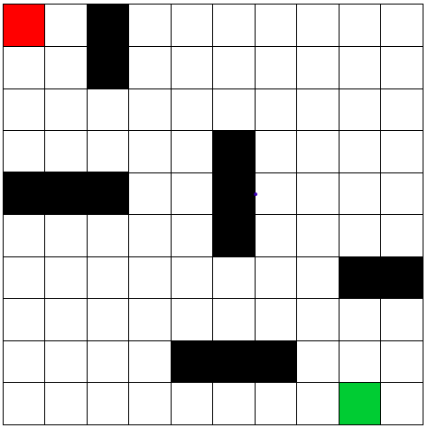

# Inteligência Artificial - Trabalho 01: Implementação do A*

Aluno: Hellesandro Gonzaga de Carvalho

### Especificação:
- Implementação do A* de acordo com as especificações do texto complementar: [A* Pathfinding para iniciantes](https://github.com/gonzH/ifes-ia-a_star/blob/master/materiais/A_Pathfinding_Para_Iniciantes.pdf)
- Para minimizar o problema, o caminho planejado pelo agente é em linha reta 90 graus (Manhattan) portanto não se movimenta na diagonal; 
- Entrada: **mapa.txt, ponto inicial, objetivo**;
- Saída: **um mapa com o desenho da trajetória, lista das coordenadas a serem percorridas**;
- Material auxiliar: [Video: Explicação do Algoritmo A* (A Star)](https://www.youtube.com/watch?v=o5_mqZKhTvw&ab_channel=CarlosMingoto)


## Relatório - Implementação do A*

### Conceito

De acordo com ZANCHIN(2018),
>A* (A-estrela) é a combinação de aproximações heurísticas, como do algoritmo de busca em largura e do algoritmo de Dijkstra (1959). A principal diferença entre ele e o algoritmo A* é a ausência de uma função heurística que facilite e diminua o número de nós expandidos, pois a cada passo o algoritmo de Dijkstra verificaria os nós adjacentes para efetuar a avaliação, sem se importar com uma ordem ou priorização dos ramos, o que acontece no algoritmo A* devido a utilização da função heurística determinada pelo problema.

Desse modo, para o algoritmo A* temos:

```math
f(n) = g(n) + h(n)
```

Onde:
- **g(n)** é o custo para alcançar cada nó
- **h(n**) é o menor custo partindo da origem para chegar no destino
- **f(n)** é o custo estimado da solução de custo mais baixo passando por n

<br>

**Referência:** ZANCHIN, Betina Carol. Análise do algorítmo A* (a estrela) no planejamento de rotas de veículos autônomos. 2018. 63 f. Trabalho de Conclusão de Curso (Engenharia Eletrônica) - Universidade Tecnológica Federal do Paraná, Ponta Grossa, 2018.

### Problema

O problema proposto é o caminho descrito na figura a seguir, onde um objeto precisa caminhar verticalmente/horizontalmente do ponto inicial, até o ponto final, sem que este colida com os obstáculos(em preto). O algoritmo deve ser capaz de definir o melhor caminho, de acordo com a heurística recebida.

Legenda:
- Vermelho é o ponto inicial;
- Verde é o ponto final;




### Implementação

A implementação foi feita em Python orientado a objetos, não sou o maior fã de orientação a objetos em Python (evito sempre que posso) mas como tive problemas com o código procedural, especialmente na etapa de "desenhar" o caminho de volta/percorrido, a orientação a objetos salvou o dia já que agora eu posso simplesmente saber "de onde eu vim" consultando um atributo, maravilha, vamos lá.

O projeto possui:
- `node.py`: Classe utilizada pelo arquivo `a_star.py` para lidar com os nós, possui um método construtor e um comparativo;
- `a_star.py`: Arquivo que contém o algoritmo A*;
- `input_loader.py`: Arquivo que contém uma função para lidar com os mapas de entrada .TXT e retorna em lista 2D;
- `main.py`: Arquivo que contém a chamada para a função do A*;

### O algoritmo A* (a_star.py)
A explicação é melhor acompanhada pelos comentários no código.

Mas basicamente a estratégia foi, para cada nó atual, olhar para as direções possíveis que era cima, baixo, esquerda, direita (90 graus) e calcular a h(n) que foi intuitivo do tipo "estou aqui, quero chegar ali, quanto é a distancia daqui ali?". Além disso, fazer o caminho de volta em orientação a objeto foi mais simples ~~(o procedural não funcionou, desisti e fui pra OO)~~.

### Como rodar
Tendo **Python 3.7** instalado e uma pasta chamada "maps" no mesmo diretório que os códigos fonte, execute o arquivo `main.py` no terminal.
Para atender a especificação do trabalho digite:
- 0,0
- 9,8
- mapa1


### Observação:
- Caso tenha interesse em adicionar movimentos diagonais, em `a_star.py"`:
    - Localize o vetor de movimentos ```[(-1, 0), (0, -1), (1, 0), (0, 1)]``` e substitua por ```[(0, -1), (0, 1), (-1, 0), (1, 0), (-1, -1), (-1, 1), (1, -1), (1, 1)]```. No geral a ordem não importa, exceto se você quiser que o agente tenha preferência por uma determinada direção.
    - Altere **h(n)** para uma heurística que considere movimentos diagonais como o Teorema de Pitágoras, existem várias formas de calcular **h(n)** mas aqui vai um exemplo:
        ```
        candidate.h = ((candidate.position[0] - goal_node.position[0]) ** 2) \
                    + ((candidate.position[1] - goal_node.position[1]) ** 2)
        ```